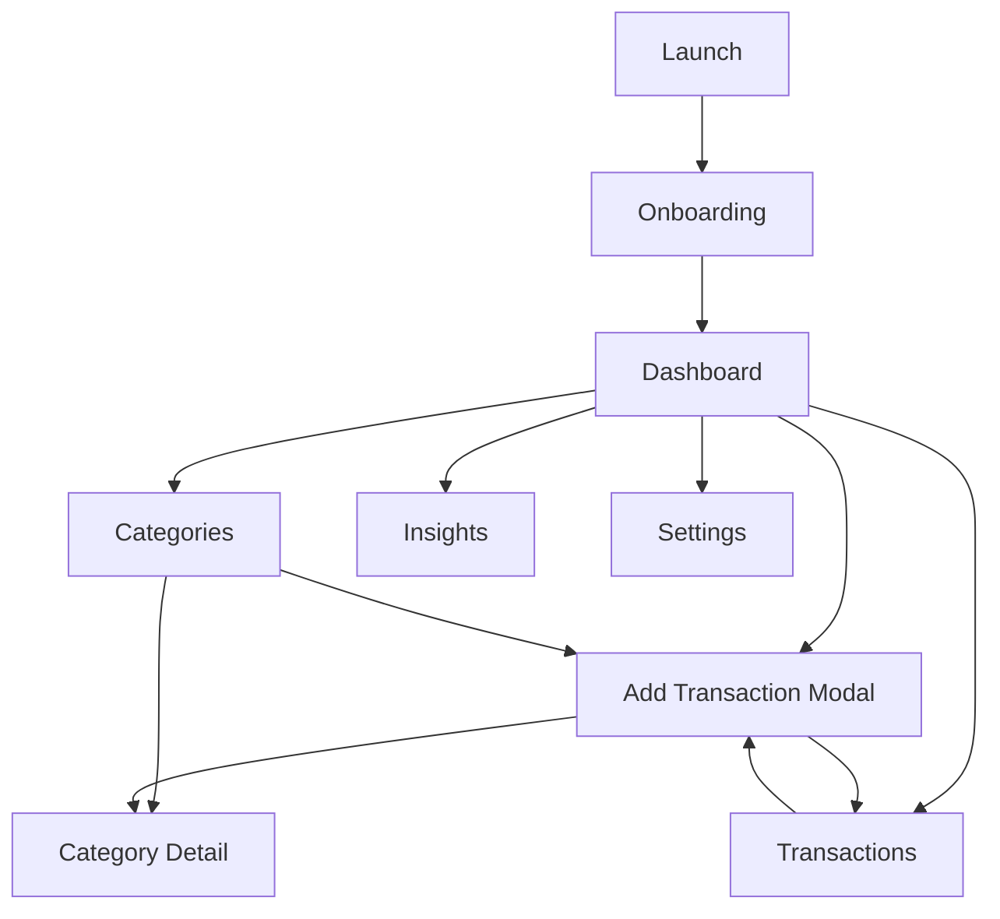

# UX / Information Architecture

## Navigation (recommended)
Bottom tabs + modal add flow:
- **Dashboard**
- **Categories**
- **Transactions**
- **Insights**
- **Settings**

Primary action: floating “+” for Add Transaction.

## Core screens

### 1) Dashboard (This Period)
- Summary tiles:
  - Remaining this period
  - Safe-to-spend today (optional)
  - Upcoming bills (MVP+)
- “Left-to-spend” highlights:
  - Food left this week
  - Recreation left today
- Chart: spending vs budget (cumulative)

### 2) Categories
- List grouped by Need/Want (or custom groups)
- Each category shows:
  - remaining this period
  - status (on track / warning / overspent)

### 3) Category Detail
- Remaining, spent, budget
- **Left today** and **Left this week**
- Burn-down chart
- Recent transactions in category

### 4) Transactions
- List with filters:
  - by category
  - by date range
  - by account (if linked)
- Edit/delete transaction (local)

### 5) Insights
- Month comparisons
- Top merchants / categories
- Trends: average grocery spend, etc.

### 6) Settings
- Budget cycle settings
- Week start day
- Currency / locale
- Export / import
- Security (passcode/biometrics)
- Connected accounts (optional)

## Design principles
- Default to **clarity**, not density
- Use color for status and category identity, not decoration
- Make “left to spend” the hero metric
- Allow drill-down, avoid showing everything at once

## Mermaid: Navigation map

