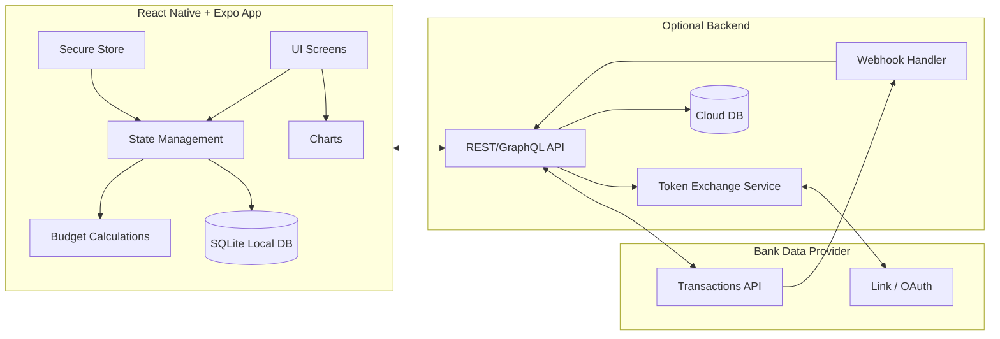

# Technical Architecture

## 1) Overview

A recommended approach is **local-first** with optional cloud/bank integrations.

- **Local-first**: users can fully budget and track spending without any account linking.
- **Optional integrations**: bank sync requires a small backend service for secure token exchange.

## 2) Proposed stack

### Mobile (React Native + Expo)
- Expo (managed workflow), TypeScript
- Navigation: `@react-navigation/*`
- State:
  - UI state: Zustand or Redux Toolkit (pick one)
  - Server/cache state (if backend): TanStack Query
- Persistence:
  - SQLite via `expo-sqlite`
  - Optional ORM: Drizzle or Kysely (or handcrafted SQL)
- Charts:
  - `victory-native` (classic) or `react-native-svg` + custom D3
  - Alternative: `react-native-gifted-charts` for quick wins
- Auth:
  - Local device auth: `expo-local-authentication`
- Secrets:
  - `expo-secure-store` for tokens / encryption keys

### Backend (optional)
- Serverless functions (recommended):
  - Supabase Edge Functions / Cloudflare Workers / AWS Lambda
- DB (if needed):
  - Postgres (Supabase) or DynamoDB
- Bank provider:
  - Plaid-style provider (Link flow + transactions)

## 3) Architecture diagram (Mermaid)

## 4) Module boundaries

### Domain modules (recommended)
- `budgeting/`
  - periods, categories, allocations, rollover rules
- `transactions/`
  - transaction CRUD, import pipeline, reconciliation
- `insights/`
  - aggregations, comparisons, chart data builders
- `settings/`
  - preferences: week start, currency, cycle type
- `sync/` (optional)
  - cloud sync, bank sync, conflict resolution

## 5) Key design decisions

### Local-first benefits
- Fast, resilient offline usage
- Less compliance overhead for MVP
- Better privacy story

### Tradeoffs
- Multi-device sync requires explicit work
- Bank sync is more complex and requires backend
