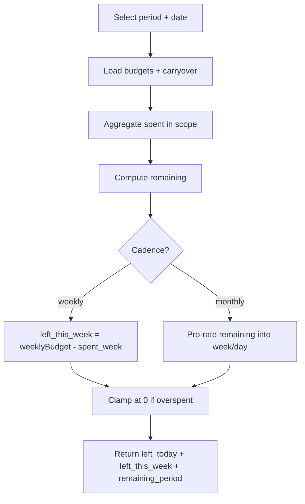

# Budget Calculations

This doc defines **how numbers are computed** so the UI stays consistent across screens and charts.

## Definitions

- `period`: current budgeting window (monthly or biweekly)
- `cadence`:
  - `monthly`: budgeted once per period
  - `weekly`: budgeted per week window inside a period
- `spent`: sum of spending transactions (negative amounts) in scope
- `remaining`: budgeted + carryover − spent

> Convention: spending transactions are stored as **negative** cents.  
> Then: `spent_cents = -SUM(amount_cents where amount_cents < 0)`.

## Step 1: Determine scope (period / week)

### Period boundaries
- Monthly: `[YYYY-MM-01, YYYY-MM-last]`
- Biweekly: `[anchor + 14k, anchor + 14k + 13]` (inclusive end)

### Week boundaries
User picks `weekStart` (e.g., Monday).
For a date `d`, week window is:
- `weekStartDate = startOfWeek(d, weekStart)`
- `weekEndDate = weekStartDate + 6 days`

## Step 2: Budgeted amount in scope

### Monthly cadence
- `budgeted_period = budget.amount_cents`

### Weekly cadence (two valid approaches)

**Approach A (recommended): Weekly windows inside period**
- Compute the set of week windows that overlap the period.
- For each week window, budget is `budget.amount_cents`.
- Then:
  - `budgeted_period = budget.amount_cents * number_of_weeks_overlapping_period`
  - `budgeted_this_week = budget.amount_cents` if that week overlaps period

Pros: intuitive; works even if month starts midweek.  
Cons: some months have 4–5 overlapping weeks, which changes total.

**Approach B: Convert weekly to monthly**
- Convert weekly to monthly using a multiplier (e.g., 52/12 weeks)
- Then distribute monthly

Pros: smoother month totals.  
Cons: week-based “left this week” becomes less grounded.

Pick one and be consistent. The rest of this doc assumes **Approach A**.

## Step 3: Spent in scope

### Spent in period
- Sum transactions where:
  - `transaction.period_id == period.id`
  - `category_id == category.id`
  - `amount_cents < 0`
  - exclude deleted

### Spent this week
- Additionally require `date in [weekStartDate, weekEndDate]`

## Step 4: Remaining

### Remaining in period
`remaining_period = carryover_cents + budgeted_period - spent_period`

### Remaining this week (weekly cadence)
`remaining_week = budget.amount_cents - spent_week`

For monthly cadence categories, “remaining this week” is derived from remaining_period and distribution rules (see below).

## Step 5: “Left to spend today” and “left to spend this week”

### A) Monthly cadence category

**Left this week**
1. Compute `remaining_period`
2. Compute `days_left_in_period_in_this_week`:
   - intersection of [today..period_end] with [weekStart..weekEnd]
3. Compute `days_remaining_in_period = countDays(today..period_end)`
4. Allocate the remaining proportionally:
   - `left_this_week = remaining_period * (days_left_in_period_in_this_week / days_remaining_in_period)`

**Left today**
- `left_today = left_this_week / days_left_in_week_remaining` (or `remaining_period / days_remaining_in_period`)

Default clamps:
- `left_today = max(0, floor(left_today))`
- `left_this_week = max(0, floor(left_this_week))`

### B) Weekly cadence category
- `left_this_week = max(0, remaining_week)`
- `left_today = max(0, remaining_week / days_remaining_in_week)`

## Handling overspend
If `remaining_period < 0`:
- show `overspent_amount = -remaining_period`
- `left_today = 0`
- `left_this_week = 0`

If rollover is enabled:
- carry negative into next period as `carryover_cents`

## Example

Period: Feb 1–Feb 28 (28 days)  
Today: Feb 10  
Groceries weekly budget: $120  
Spent this week so far: $70  
Days remaining in week: 4

- `remaining_week = 120 - 70 = 50`
- `left_today = 50 / 4 = 12.50` → $12.50

## Mermaid: left-to-spend computation flow

