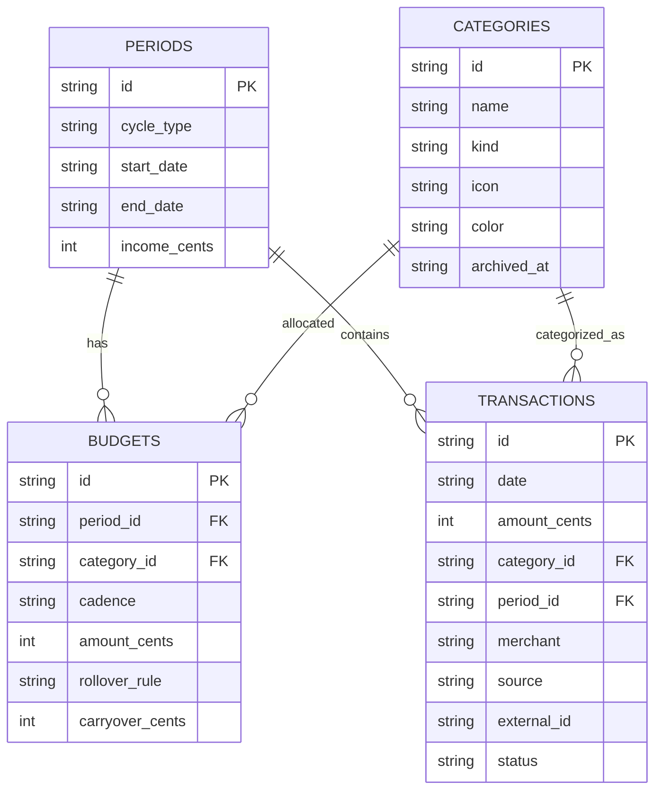

# Data Model

This app benefits from a **simple, query-friendly** schema that supports:

- periods (monthly or biweekly)
- category budgets per period
- transactions (manual + imported)
- rollovers

## Data types & conventions
- Money stored as **integer cents** (e.g., $12.34 → 1234)
- Dates stored as ISO `YYYY-MM-DD` (local user timezone)
- Timestamps as ISO with timezone offset
- All primary keys: UUID (string)

## Core tables

### `periods`
Represents a budgeting window (calendar month or pay period).

| Column | Type | Notes |
|---|---|---|
| id | TEXT (UUID) | PK |
| cycle_type | TEXT | `monthly` \| `biweekly` |
| start_date | TEXT | inclusive |
| end_date | TEXT | inclusive |
| income_cents | INTEGER | planned income for period |
| created_at | TEXT | |
| closed_at | TEXT | nullable |

Indexes:
- `(start_date, end_date)`
- `cycle_type`

### `categories`
| Column | Type | Notes |
|---|---|---|
| id | TEXT | PK |
| name | TEXT | unique-ish per user |
| kind | TEXT | `need` \| `want` \| `custom` |
| icon | TEXT | e.g., “cart”, “home” |
| color | TEXT | hex |
| archived_at | TEXT | nullable |

### `budgets`
A category’s allocated amount for a specific period.

| Column | Type | Notes |
|---|---|---|
| id | TEXT | PK |
| period_id | TEXT | FK → periods.id |
| category_id | TEXT | FK → categories.id |
| cadence | TEXT | `monthly` \| `weekly` |
| amount_cents | INTEGER | allocation for cadence |
| rollover_rule | TEXT | `reset` \| `pos` \| `pos_neg` |
| carryover_cents | INTEGER | computed at period creation (can be 0) |
| created_at | TEXT | |

Indexes:
- `(period_id, category_id)` unique

### `transactions`
| Column | Type | Notes |
|---|---|---|
| id | TEXT | PK |
| date | TEXT | transaction date |
| amount_cents | INTEGER | negative for spending, positive for income (or separate type) |
| category_id | TEXT | FK |
| period_id | TEXT | FK (denormalized for speed) |
| merchant | TEXT | optional |
| note | TEXT | optional |
| source | TEXT | `manual` \| `import` |
| external_id | TEXT | provider transaction id, nullable |
| status | TEXT | `posted` \| `pending` |
| created_at | TEXT | |
| updated_at | TEXT | |
| deleted_at | TEXT | soft delete |

Indexes:
- `(period_id, date)`
- `(category_id, date)`
- `external_id` (unique when not null)

### Optional tables (MVP+)
- `accounts` (bank accounts / cards)
- `import_batches` (for reconciliation & debugging)
- `merchant_category_rules` (auto-categorization)
- `splits` (split transactions across categories)

## Mermaid ER diagram

## Query examples (conceptual)

### Remaining this period for a category
`remaining = (carryover + budgeted) - spent_to_date`

Where:
- `budgeted` depends on cadence:
  - monthly: `amount_cents`
  - weekly: `amount_cents * weeks_in_period` (or allocate weekly windows; see calculations doc)
- `spent_to_date` = sum of negative transaction amounts in the period/category.
