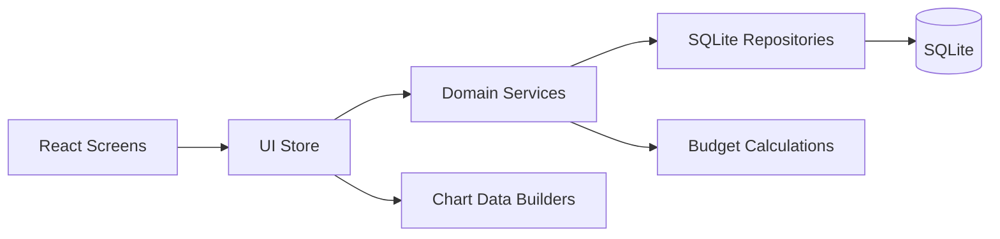

# State Management

## Goals
- Keep business logic out of UI components
- Support offline-first reads/writes
- Keep charts fast by caching aggregated summaries

## Recommended pattern
A 3-layer approach:

1. **Repository layer** (SQLite)
2. **Domain services** (calculations, validation, rules)
3. **UI state store** (Zustand/Redux) + derived selectors

### Mermaid: data flow

## Store slices (example)
- `settingsSlice` – week start, currency, cycle type
- `periodSlice` – selected period, list of periods
- `categorySlice` – categories + editing state
- `budgetSlice` – budgets per period
- `transactionSlice` – transactions list + filters
- `syncSlice` – sync status (optional)

## Caching strategy
- Cache common aggregates per period:
  - total spent
  - spent per category
  - weekly spend buckets
- Invalidate aggregates when:
  - transaction changes
  - budget changes
  - rollover applied

## Offline-first approach
- Write operations update SQLite first (source of truth)
- Store listens to DB changes (or re-queries on write completion)
- If backend/sync exists:
  - queue outbound writes
  - reconcile on next sync
