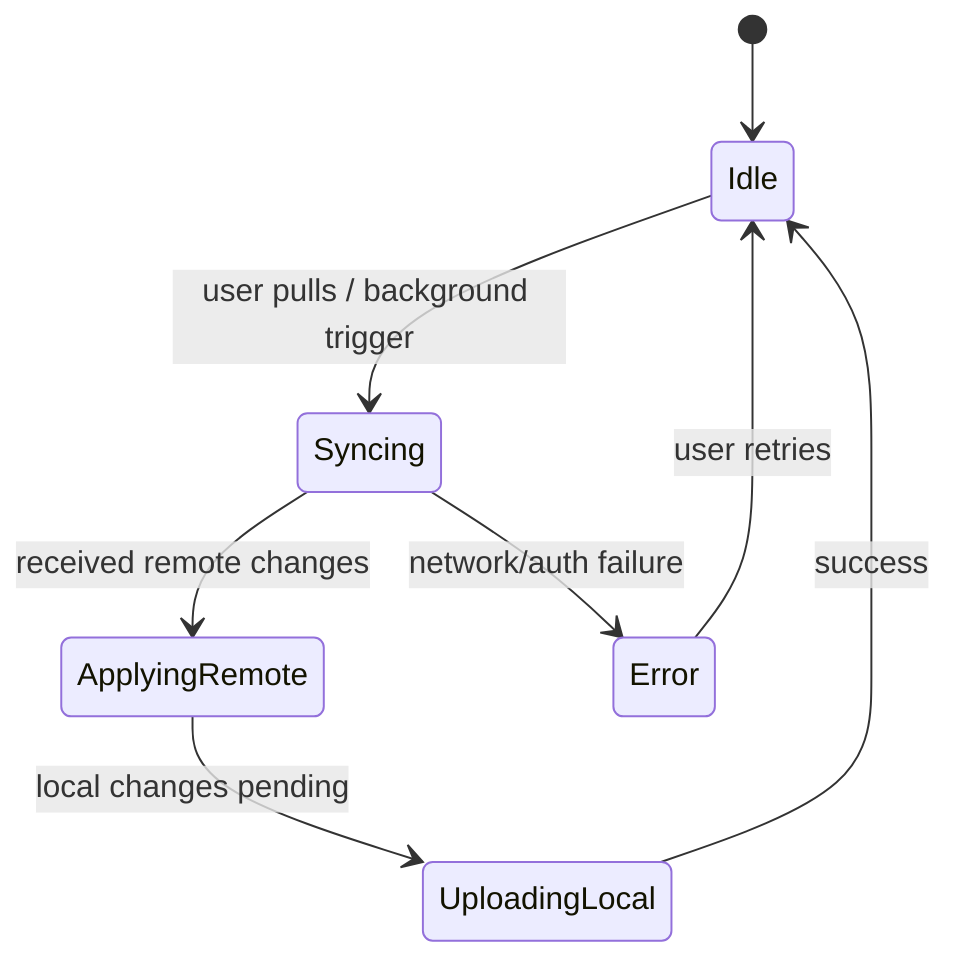

# Offline & Sync Strategy

## MVP (recommended)
**Offline-only** with local backups/export.
- SQLite is the source of truth
- Users can export CSV or JSON for backup

## Optional: Cloud sync (multi-device)
If you add sync, treat the client as **offline-first**:

### Core principles
- Every record has:
  - `id` (UUID)
  - `updated_at`
  - `deleted_at` (tombstone)
- Client keeps a **sync cursor** per table

### Minimal sync algorithm
1. Client sends `since = last_sync_time`
2. Server returns changed rows since `since`
3. Client upserts + applies tombstones
4. Client uploads its local changes since `since`
5. Update `last_sync_time`

### Conflict resolution policy (simple)
- Last-write-wins based on `updated_at`
- For money totals, last-write-wins is acceptable if edits are rare; otherwise:
  - use per-transaction immutability + corrections via new transactions

## Optional: Bank transaction sync
### Import pipeline
1. Fetch transactions (posted + pending)
2. Normalize amounts to cents, local date
3. Deduplicate:
   - primary key: provider external id
   - fallback: (date, amount, merchant) within a tolerance window
4. Categorize:
   - merchant rules
   - user override stored as rule

### Reconciliation UX (MVP+)
- Imported transaction appears “Uncategorized”
- User taps to assign category
- App remembers mapping for next time

## Mermaid: sync state machine

